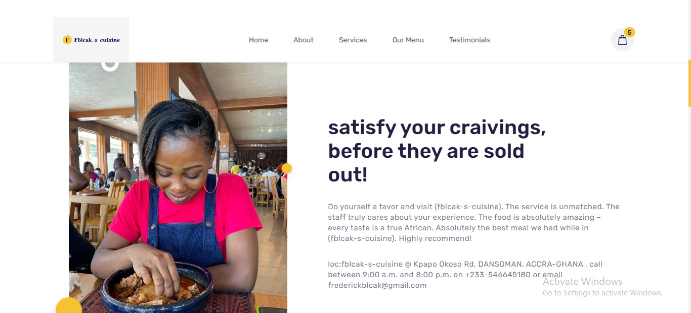

# fblcak-s-cuisine

fblcak-s-cuisine
  is a fully responsive restuarant website, responsive for all devices, built using HTML, CSS, and JavaScript.

## Demo




## Prerequisites

Before you begin, ensure you have met the following requirements:

* [Git](https://git-scm.com/downloads "Download Git") must be installed on your operating system.

## Installing

To install **fblcak-s-cuisine**, follow these steps:

Linux and macOS:

```bash
sudo git clone https://fblcak.github.io/fblcak-s-cuisine/
```

Windows:

```bash
git clone https://fblcak.github.io/fblcak-s-cuisine/
```

## Contact

Am always available for collaboration , If you want to contact me you can reach me at [Twitter](https://www.twitter.com/Freddyblcak),[Instagram](https://www.instagram.com/freddyalabaster),[Facebook](https://www.facebook.com/FrederickKojoAdzoho),[Linkdin](http:www.linkedin.com/in/frederick-adzaho-7655b4248)

## License

This project is **free to use** and does not contains any license.
